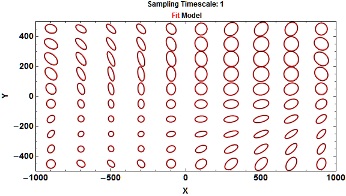

# Diffusive Dynamics 

A set of packages to calculate position-dependent diffusion coefficients in one and two dimensions from collective variables trajectories written in *[Mathematica](http://www.wolfram.com/mathematica/)&#174;*. 

## Installation
Download the zip file of the repository (link in the lower right corner). Extract the file to any location and evaluate `Install.nb` file (from *Mathematica*), which will install the package automatically. 

The package can also be installed manually. Copy the `DiffusiveDynamics` subdirectory to the `$UserBaseDirectory/Applications` directory. The full path to the directory can be obtained (and copied to the clipboard)  by running this *Mathematica* commands:

	userdir = FileNameJoin[{$UserBaseDirectory, "Applications"}]
	CopyToClipboard[userdir]

If perfomance is paramount a C compiler can be installed to speed up crucial parts of the package. More information about installing a compiler for *Mathematica* can be found [here](http://reference.wolfram.com/mathematica/CCompilerDriver/tutorial/SpecificCompilers.html) (and [here](http://mathematica.stackexchange.com/questions/6897/what-compilers-are-suitable-for-compilationtarget-c) and [here](http://mathematica.stackexchange.com/questions/6897/what-compilers-are-suitable-for-compilationtarget-c)).
 

## Quick Start
Tuturials are available in the `Tutorials` folder. For the courious here is a quick start (this is a shortened version of `Tutorials/01-QuickStart2D.nb`):

### Load needed packages

	(*Load the package*)
	Needs["DiffusiveDynamics`"]
	(*Load the package for parallel kernels as well*)
	ParallelNeeds["DiffusiveDynamics`"]

### Define diffusion parameters
	
	(*The number of steps*)
	STEPS = 1000000;
	(*The time step*)
	STEP = 1; 
	(*The unit cell vectors (origin is at 0,0 and the size is from -1000 
	to 1000 in the x and -500 to 500 in the y dimension*)
	CELLRANGE = {1000., 500.}; 
	
	(* For maximum speed the diffusion expression should be compiled *)
	(* The diffusion is given as the major and minor axis of the diffusion 
	   tensor and the angle of rotation around the origin from the original 
	   x axis *)
	DIFFX = Compile[{x, y},
	   5 Sin[x/ CELLRANGE[[1]] \[Pi]] + 10];
	DIFFY = Compile[{x, y},
	   5 Sin[y/ CELLRANGE[[2]] \[Pi]] + 10];
	ALPHA = Compile[{x, y},
	   (((x/2)/CELLRANGE[[1]])^2 + ((y/2)/ CELLRANGE[[2]])^2)*180];
	
	(*Energy is in units of kT*)
	KT = 1;
	(*Here as a simplest case energy is constant*)
	ENERGY = Compile[{x, y}, 0];

### Generate the trajectory
	(*Uses all available cores and by default generates 
      2*number of cores of segements. The total length off all segments is equal to STEPS. *)
	
	
	rw = ParallelGenerateDiffusionTrajectory2D[STEPS, DIFFX, DIFFY, ALPHA,
	    ENERGY, KT, STEP, {-CELLRANGE, CELLRANGE}];

### Analyze the trajectory
	w = CELLRANGE/5;
	binSpec = Transpose[{-CELLRANGE, CELLRANGE, w}];
	(* we also have to decide what strides we would like. Strides 
	   basically adjust the sampling timescale to Stride*Timestep *)
	STRIDES = {1, 10, 100};
	diffs = GetDiffusionInBins[rw, STEP, binSpec, "PadSteps" -> True, 
	   "Strides" -> STRIDES, "Parallel" -> True];

#### Get the model diffusion as well	

	modelDiffs = 
	  GetDiffusionInfoFromParameters[binSpec, STEP, STRIDES, DIFFX, DIFFY, ALPHA, "Parallel" -> True];

### Visualize the result

	(*We see almost perfect aligment at stride 1*)
	DrawDiffusionTensorRepresentations[{diffs[[All, s]], modelDiffs[[All, s]]}, 1(*this 1 is the selected bin*)
	 , Scale -> 3.5, ImageSize -> Large
	 , PlotLabel -> 
	  Row@{"Sampling Timescale: ", s*STEP, "\n", Style[" Fit ", Red], "Model"}
	 , PlotStyle -> {Directive[Thick, Red, Opacity@.8], Directive[Thin, Black, Opacity@.8]}
	 , LabelStyle -> {14, Bold, FontFamily -> "Arial"}
	 , FrameLabel -> {"X", "Y"}, Axes -> False
	 ]

##Compatibility
This code works under *Mathematica* 9. Due some strange memory leaks *Mathematica* 8 is currently not supported. A trial version of Mathematica can be obtained [here](http://www.wolfram.com/mathematica/trial/).

## Terms of Use
The code is licensed under [GPLv3](http://www.gnu.org/licenses/gpl-3.0.html). Copyright (C) 2013 Ajasja Ljubetič.
